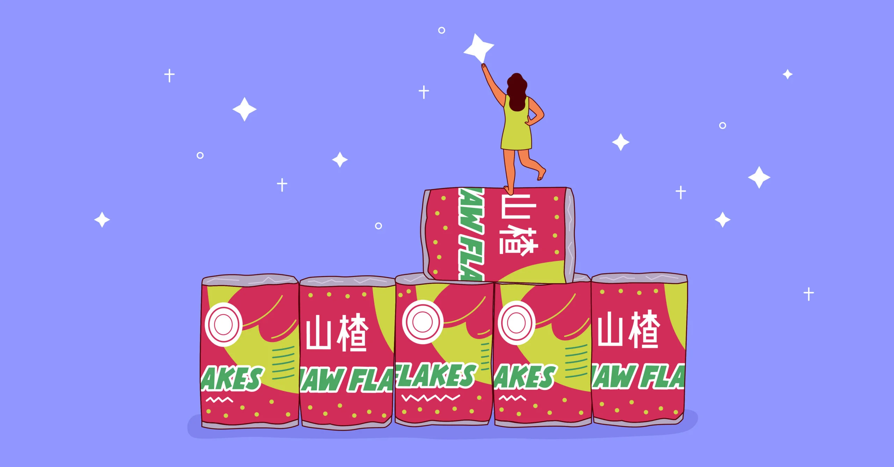

## Summary
Both a traditional medicinal ingredient and a nostalgic candy, hawthorn berries hold a special place in the hearts of many Asian Americans.

## Key Details
- **Source:** [tastecooking.com](https://tastecooking.com/the-enduring-appeal-of-haw-flakes/)
- **Title:** The Enduring Appeal Of Haw Flakes
- **Description:** Both a traditional medicinal ingredient and a nostalgic candy, hawthorn berries hold a special place in the hearts of many Asian Americans.

## Visual Assets

