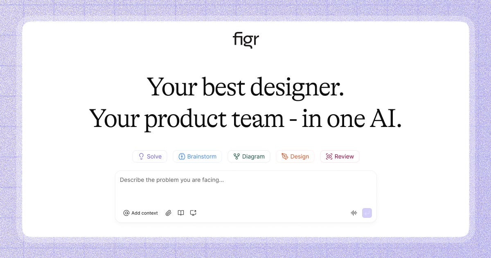

## Summary
The first design agent that actually understands your product. Drop in context like industry benchmarks, user feedback, product flow, design systems to get production-ready UX backed by real app patte

## Key Details
- **Source:** [figr.design](https://figr.design/)
- **Title:** The first design agent that actually understands your product. Drop in context like industry benchmarks, user feedback, product flow, design systems to get production-ready UX backed by real app patterns. No guesswork. No endless revisions. Just ship.
- **Description:** The first design agent that actually understands your product. Drop in context like industry benchmarks, user feedback, product flow, design systems t

## Visual Assets

