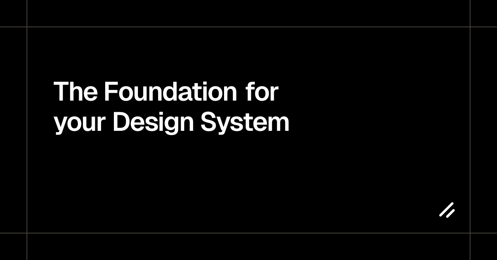

## Summary
A set of beautifully designed components that you can customize, extend, and build on. Start here then make it your own. Open Source. Open Code.

## Key Details
- **Source:** [ui.shadcn.com](https://ui.shadcn.com/)
- **Title:** The Foundation for your Design System - shadcn/ui
- **Description:** A set of beautifully designed components that you can customize, extend, and build on. Start here then make it your own. Open Source. Open Code.

## Visual Assets

