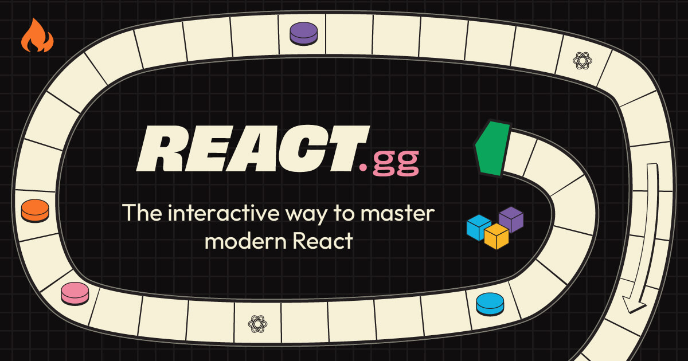

## Summary
"Just finished react.gg. Wow. The course is a masterpiece. Learned a lot, even after years of developing in React." – Austin Hale

## Key Details
- **Source:** [react.gg](https://react.gg/)
- **Title:** The interactive way to master modern React – react.gg
- **Description:** "Just finished react.gg. Wow. The course is a masterpiece. Learned a lot, even after years of developing in React." – Austin Hale

## Visual Assets

