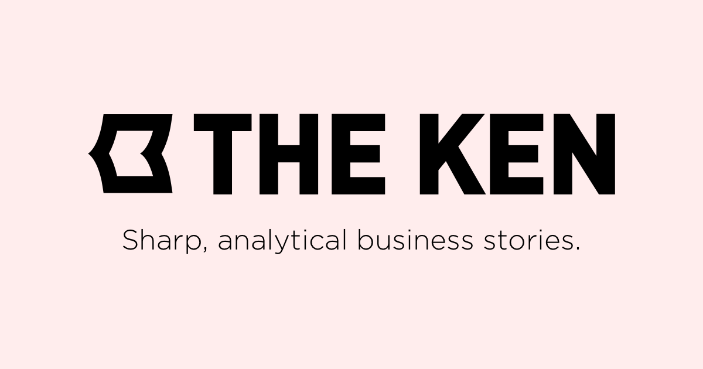

## Summary
undefined

## Key Details
- **Source:** [the-ken.com](https://the-ken.com/)
- **Title:** The Ken - Business, Startups, Technology and Healthcare news from India
- **Description:** undefined

## Visual Assets

