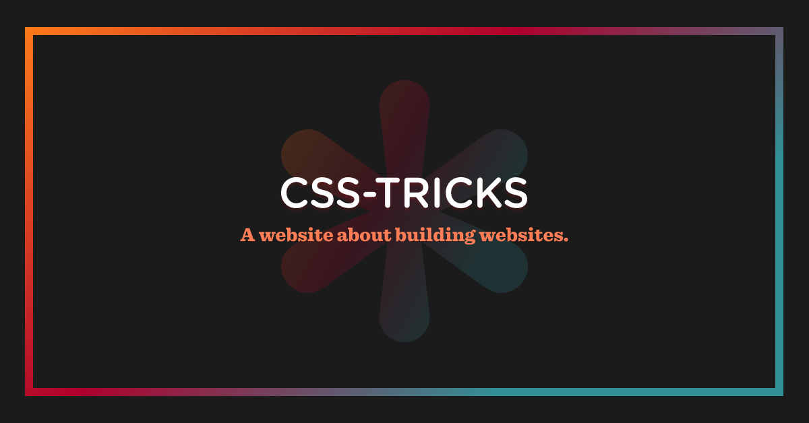

## Summary
There are quite a few properties in CSS that take a length as a value. The box model properties are the obvious ones: width, height, margin, padding, border.

## Key Details
- **Source:** [css-tricks.com](https://css-tricks.com/the-lengths-of-css/)
- **Title:** The Lengths of CSS | CSS-Tricks
- **Description:** There are quite a few properties in CSS that take a length as a value. The box model properties are the obvious ones: width, height, margin, padding, 

## Visual Assets

