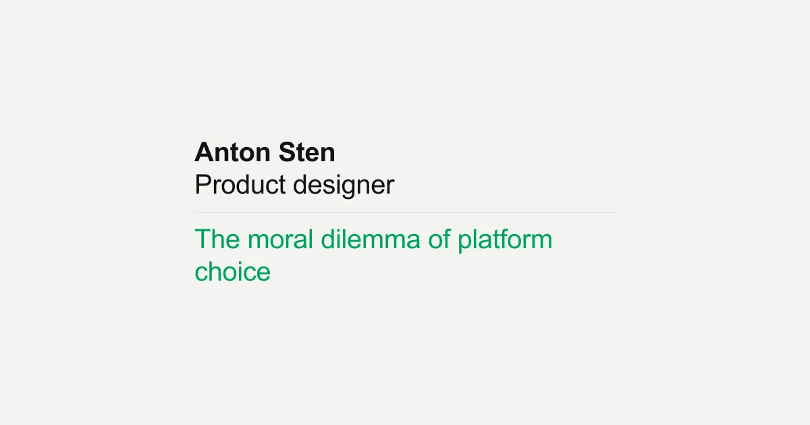

## Summary
An exploration of the ethical considerations creators face when choosing digital platforms, and how these choices reflect our values and shape the future of the internet.

## Key Details
- **Source:** [antonsten.com](https://www.antonsten.com/articles/the-moral-dilemma/)
- **Title:** The moral dilemma of platform choice – Anton Sten
- **Description:** An exploration of the ethical considerations creators face when choosing digital platforms, and how these choices reflect our values and shape the fut

## Visual Assets

