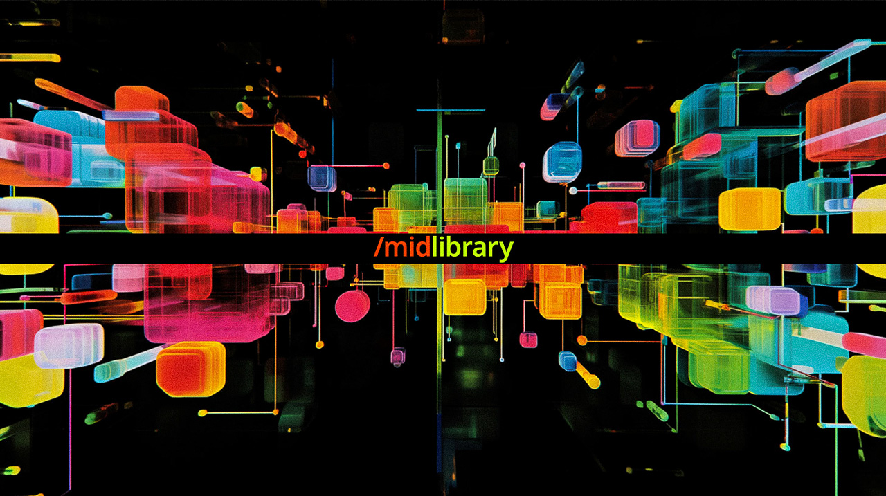

## Summary
The most advanced library of Midjourney AI artistic styles (from V6.1 to niji) and SREF codes. Midjourney Guides + Tools for Midjourney workflow

## Key Details
- **Source:** [midlibrary.io](https://midlibrary.io/)
- **Title:** The most advanced library of Midjourney AI artistic styles (from V6.1 to niji) and SREF codes. Midjourney Guides + Tools for Midjourney workflow
- **Description:** The most advanced library of Midjourney AI artistic styles (from V6.1 to niji) and SREF codes. Midjourney Guides + Tools for Midjourney workflow

## Visual Assets

