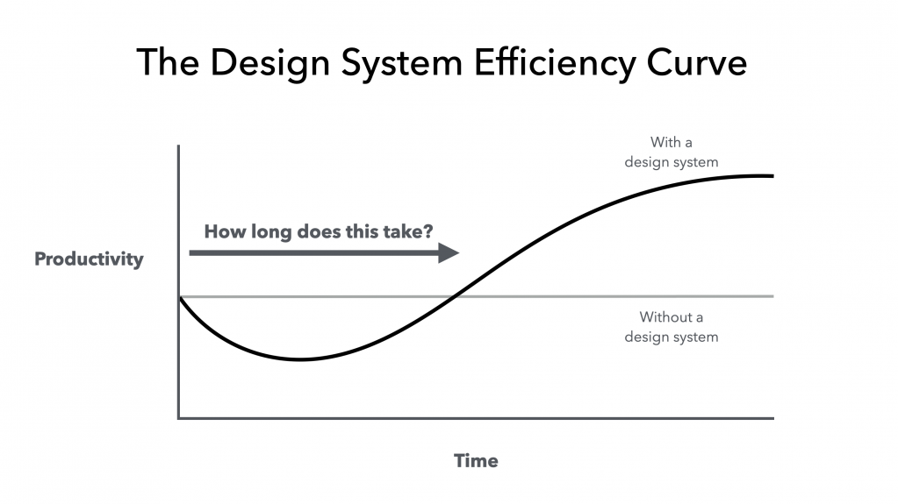

## Summary
You didn’t start your web career to be a politician or salesperson. But if you want to work on design systems, you have no choice. Ben Callahan shows you how to convince executives to fund the init…

## Key Details
- **Source:** [alistapart.com](https://alistapart.com/article/selling-design-systems/)
- **Title:** The Never-Ending Job of Selling Design Systems
- **Description:** You didn’t start your web career to be a politician or salesperson. But if you want to work on design systems, you have no choice. Ben Callahan shows 

## Visual Assets

