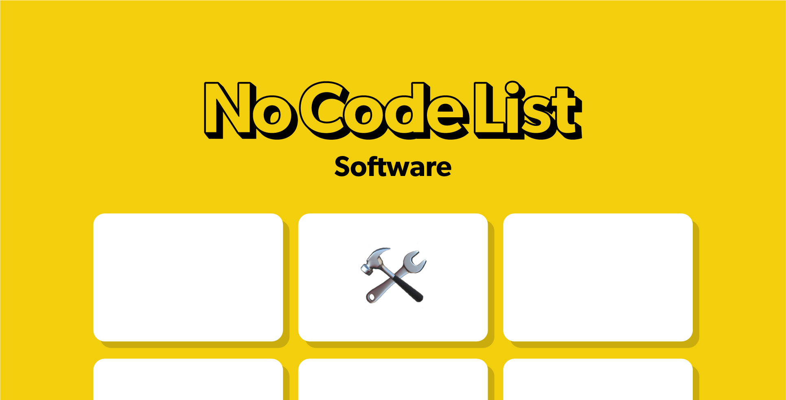

## Summary
Dive Deep into the world of NoCode! 350+ tools. 130+ Agencies. 30+ Resources. 20+ Product Stacks. The prefect place to figure out what NoCode resources can help you push your business to the next leve

## Key Details
- **Source:** [nocodelist.co](https://nocodelist.co/)
- **Title:** The No Code List - Software Reviews, and No Code Agencies
- **Description:** Dive Deep into the world of NoCode! 350+ tools. 130+ Agencies. 30+ Resources. 20+ Product Stacks. The prefect place to figure out what NoCode resource

## Visual Assets

