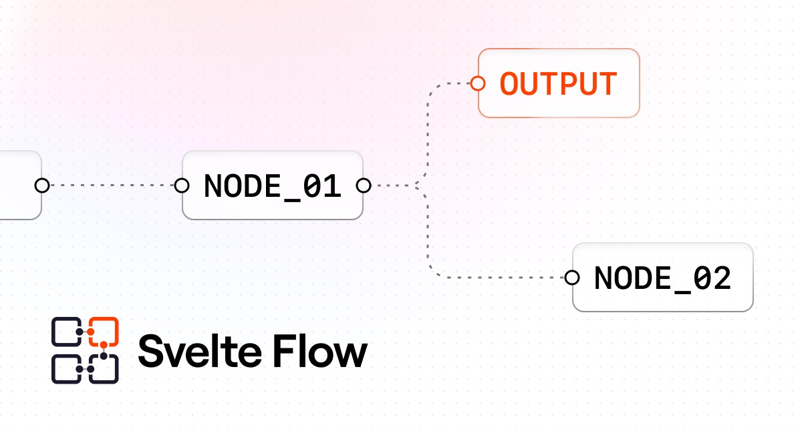

## Summary
A customizable Svelte component for building node-based editors and interactive diagrams

## Key Details
- **Source:** [svelteflow.dev](https://svelteflow.dev/)
- **Title:** The Node-Based UI for Svelte - Svelte Flow
- **Description:** A customizable Svelte component for building node-based editors and interactive diagrams

## Visual Assets

