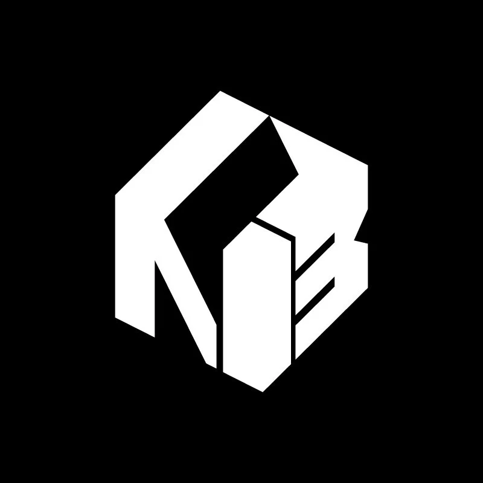

## Summary
Since 2006, The Northern Block has been acclaimed for crafting modernist fonts. Their adept team creates award-winning typefaces for contemporary use, specialising in custom designs for corporate clie

## Key Details
- **Source:** [thenorthernblock.co.uk](https://thenorthernblock.co.uk/)
- **Title:** The Northern Block
- **Description:** Since 2006, The Northern Block has been acclaimed for crafting modernist fonts. Their adept team creates award-winning typefaces for contemporary use,

## Visual Assets

