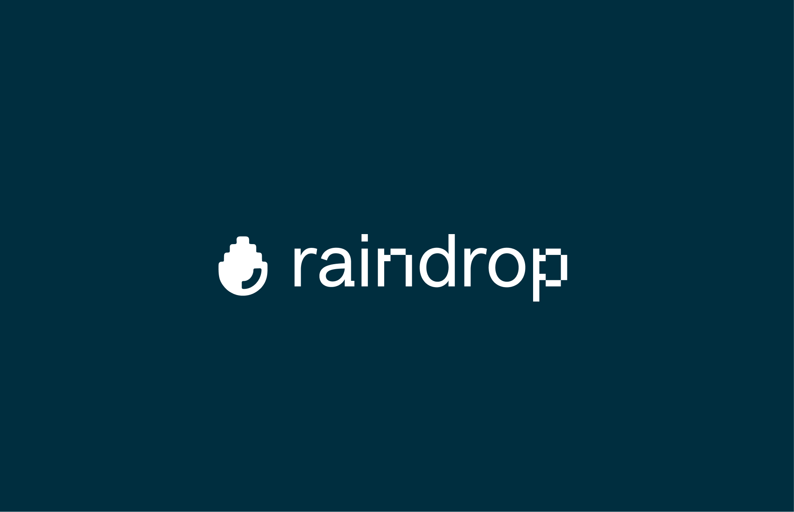

## Summary
Monitor your AI app the right way. AI engineers use Raindrop to get alerts about hidden issues in their AI products.

## Key Details
- **Source:** [raindrop.ai](https://www.raindrop.ai/)
- **Title:** The observability platform for AI Agents
- **Description:** Monitor your AI app the right way. AI engineers use Raindrop to get alerts about hidden issues in their AI products.

## Visual Assets

