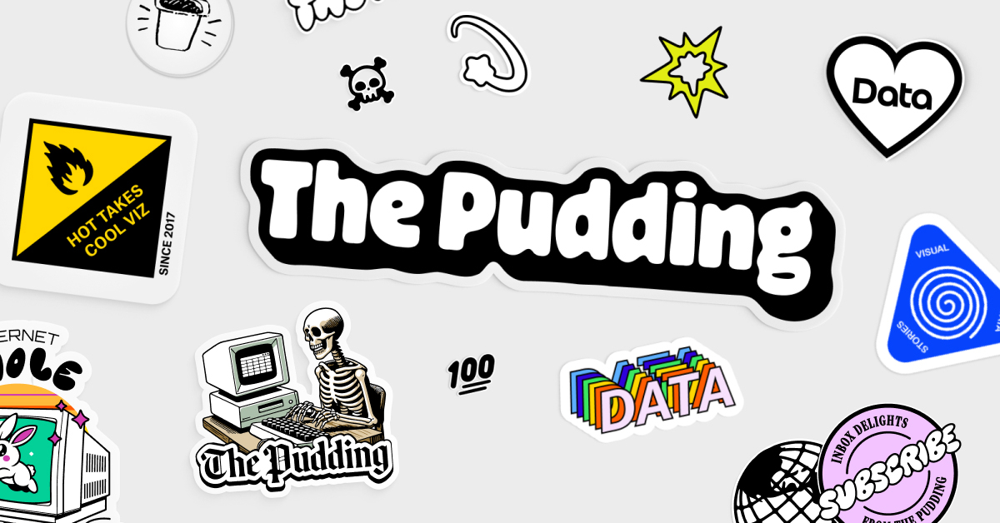

## Summary
The Pudding explains ideas with visual essays.

## Key Details
- **Source:** [pudding.cool](https://pudding.cool/)
- **Title:** The Pudding
- **Description:** The Pudding explains ideas with visual essays.

## Visual Assets

