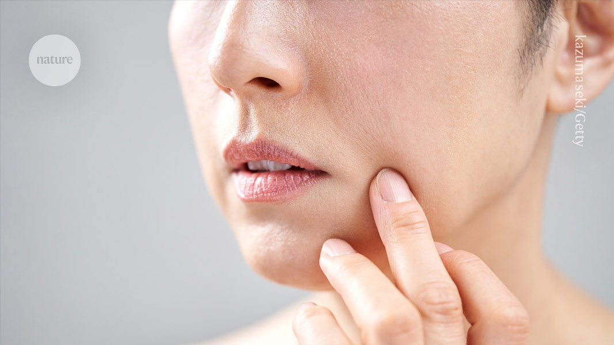

## Summary
The finding could lead to the development of needle-free vaccines.

## Key Details
- **Source:** [nature.com](https://www.nature.com/articles/d41586-024-04068-9)
- **Title:** The skin’s ‘surprise’ power: it has its very own immune system
- **Description:** The finding could lead to the development of needle-free vaccines.

## Visual Assets

