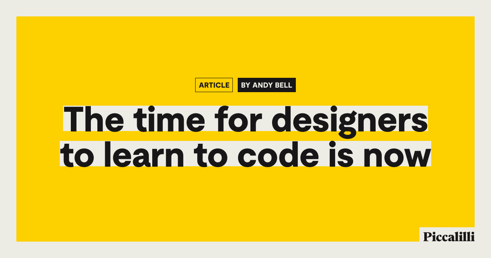

## Summary
With design tools further commoditising and sanitising expected creative output, the time for designers to be able to stand out is very much here. I think for some, learning to code is a good route fo

## Key Details
- **Source:** [piccalil.li](https://piccalil.li/blog/the-time-for-designers-to-learn-to-code-is-now/)
- **Title:** The time for designers to learn to code is now
- **Description:** With design tools further commoditising and sanitising expected creative output, the time for designers to be able to stand out is very much here. I t

## Visual Assets

