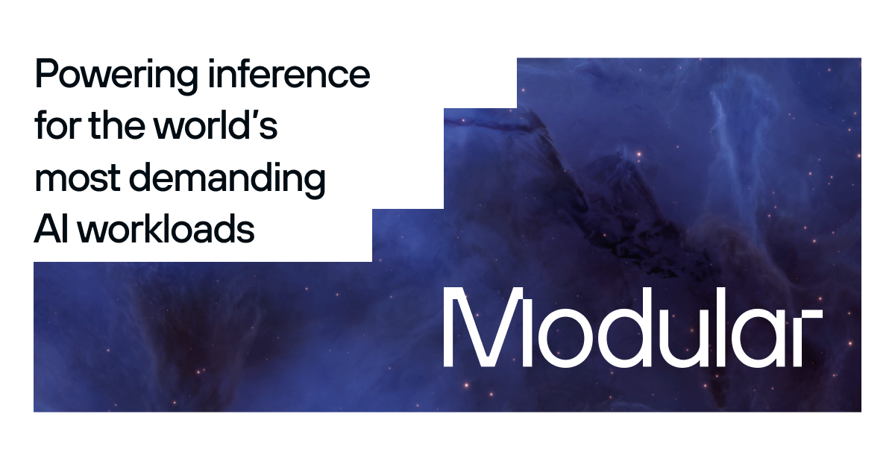

## Summary
The unified AI inference stack - from custom GPU kernels to production cloud serving on NVIDIA and AMD. 2x performance. Top open models. Open source stack.

## Key Details
- **Source:** [modular.com](https://www.modular.com/)
- **Title:** The unified AI inference stack - from custom GPU kernels to production cloud serving on NVIDIA and AMD. 2x performance. Top open models. Open source stack.
- **Description:** The unified AI inference stack - from custom GPU kernels to production cloud serving on NVIDIA and AMD. 2x performance. Top open models. Open source s

## Visual Assets

