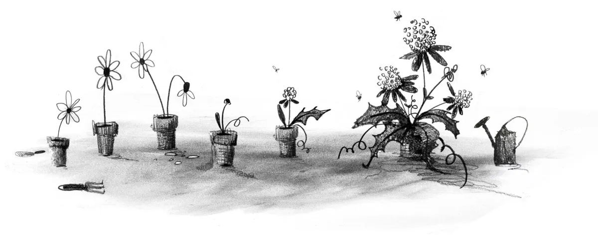

## Summary
Forget death and taxes. The only certainty on the web is change. Ste Grainer takes a brief look at the history of the web and how it has been constantly reinvented. Then he explores where we are no…

## Key Details
- **Source:** [alistapart.com](https://alistapart.com/article/the-wax-and-the-wane-of-the-web/)
- **Title:** The Wax and the Wane of the Web
- **Description:** Forget death and taxes. The only certainty on the web is change. Ste Grainer takes a brief look at the history of the web and how it has been constant

## Visual Assets

