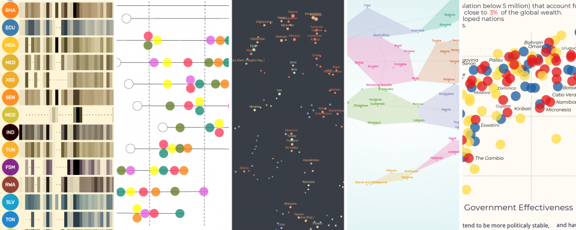

## Summary
The results are in. After combing through hundreds of impressive, insightful and creative entries, we’ve decided on the winners of...

## Key Details
- **Source:** [informationisbeautiful.net](https://informationisbeautiful.net/2019/winners-of-the-world-data-visualization-prize/)
- **Title:** The Winners of the World Data Visualization Prize 2019 — Information is Beautiful
- **Description:** The results are in. After combing through hundreds of impressive, insightful and creative entries, we’ve decided on the winners of...

## Visual Assets

