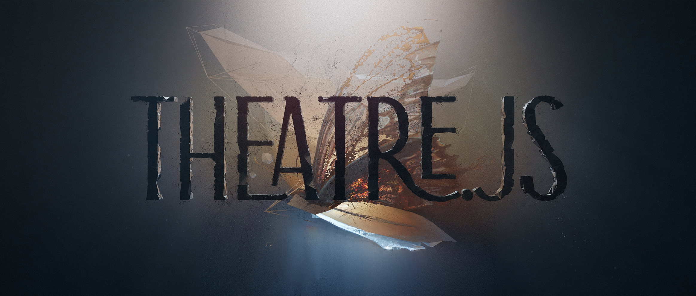

## Summary
Theatre.js is an animation editor with a visual interface.

## Key Details
- **Source:** [theatrejs.com](https://www.theatrejs.com/)
- **Title:** Theatre.js - animation toolbox for the web
- **Description:** Theatre.js is an animation editor with a visual interface.

## Visual Assets

