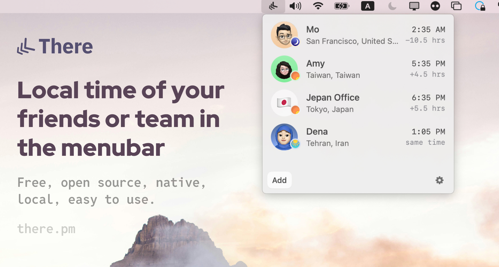

## Summary
Track local time of your friends, teammates and family. You can set photo and name and add them to your menubar.

## Key Details
- **Source:** [there.pm](https://there.pm/)
- **Title:** There - Timezones in your menubar
- **Description:** Track local time of your friends, teammates and family. You can set photo and name and add them to your menubar.

## Visual Assets

