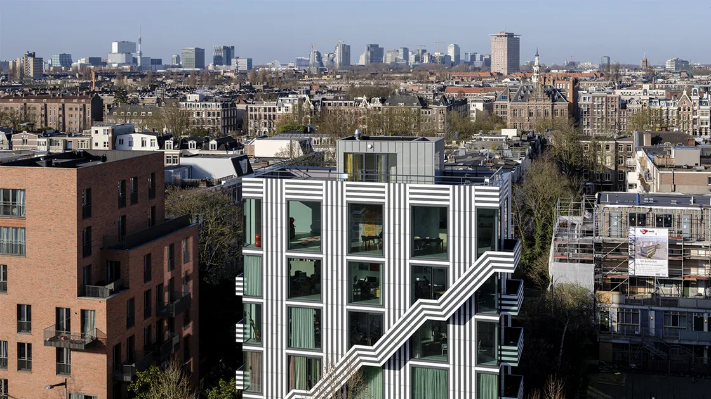

## Summary
From politics to culture to business, Dutch studio thonik strikes a balance between adventurous concepts and pragmatic resolutions.

## Key Details
- **Source:** [thonik.nl](https://thonik.nl/)
- **Title:** thonik – Home
- **Description:** From politics to culture to business, Dutch studio thonik strikes a balance between adventurous concepts and pragmatic resolutions.

## Visual Assets

