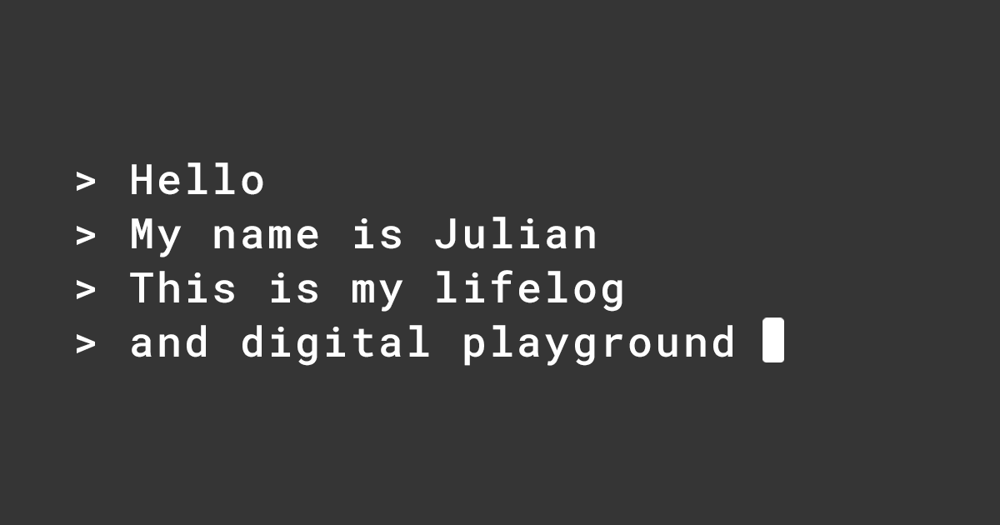

## Summary
The case against conversational interfaces (new)

Multi-layered calendars 

The power of defaults

Banking on status

Chief Notion Officer

Is this real life?

A meta-layer for notes

Pr

## Key Details
- **Source:** [julian.digital](https://julian.digital/)
- **Title:** Thoughts
- **Description:** The case against conversational interfaces (new)

Multi-layered calendars 

The power of defaults

Banking on status

Chief Notion Officer

## Visual Assets

