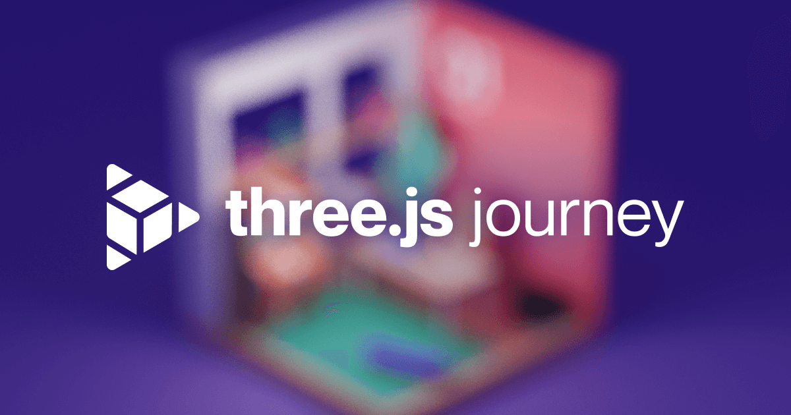

## Summary
The ultimate Three.js course whether you are a beginner or a more advanced developer

## Key Details
- **Source:** [threejs-journey.com](https://threejs-journey.com/#)
- **Title:** Three.js Journey — Learn WebGL with Three.js
- **Description:** The ultimate Three.js course whether you are a beginner or a more advanced developer

## Visual Assets

