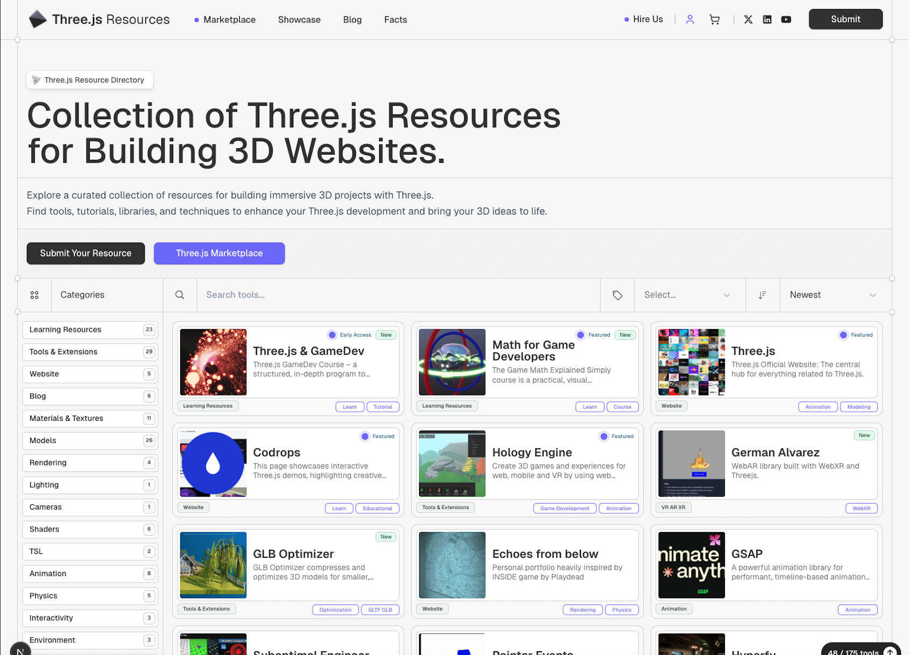

## Summary
Explore inspiring websites and projects built with Three.js. Discover the possibilities of 3D web development with these real-world examples.

## Key Details
- **Source:** [threejsresources.com](https://threejsresources.com/showcase)
- **Title:** Three.js Websites Showcase | ThreeJS Resources
- **Description:** Explore inspiring websites and projects built with Three.js. Discover the possibilities of 3D web development with these real-world examples.

## Visual Assets

