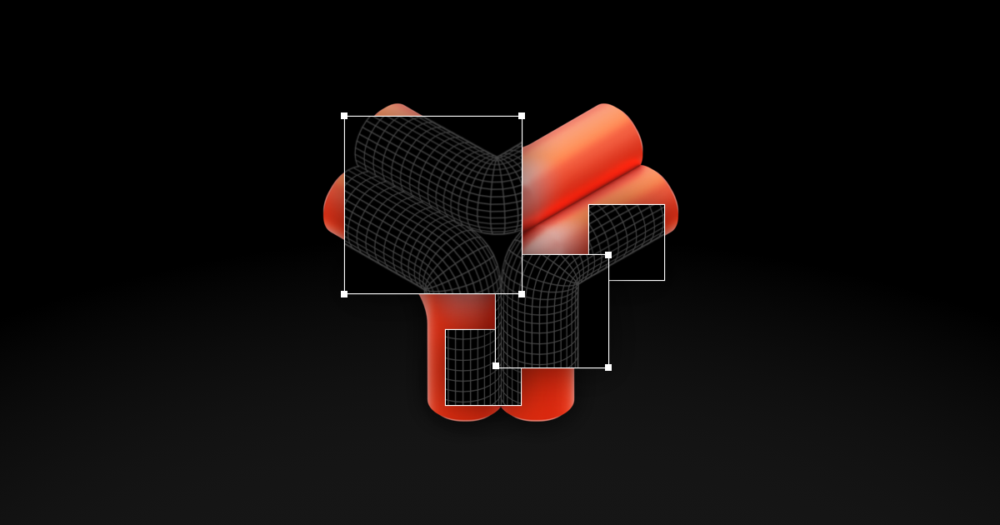

## Summary
Inspect and tweak any Three.js website.

## Key Details
- **Source:** [three.tools](https://three.tools/)
- **Title:** ThreeTools – Three.js Chrome Extension
- **Description:** Inspect and tweak any Three.js website.

## Visual Assets

