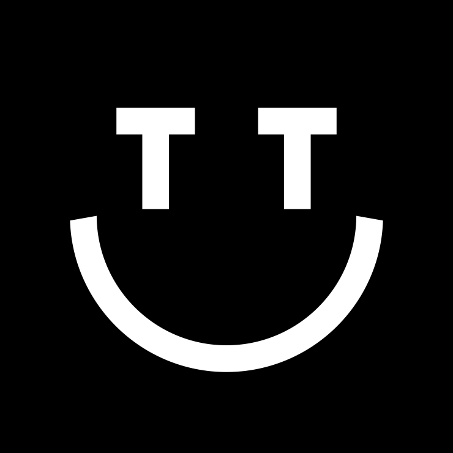

## Summary
TIGHTYPE is an independent type foundry offering contemporary typefaces for designers, magazines, and publishers worldwide. Browse our collection of unique fonts.

## Key Details
- **Source:** [tightype.com](https://tightype.com)
- **Title:** TIGHTYPE
- **Description:** TIGHTYPE is an independent type foundry offering contemporary typefaces for designers, magazines, and publishers worldwide. Browse our collection of u

## Visual Assets

