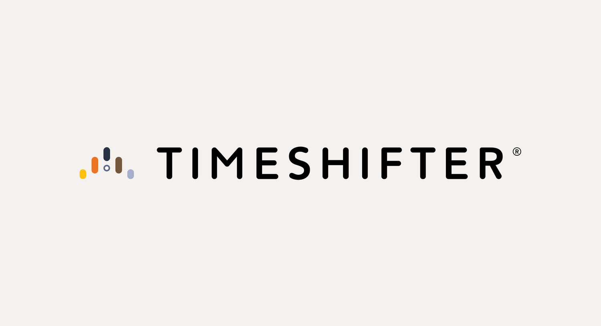

## Summary
Reduce jet lag, manage shift work disruption, and prepare for peak performance with Timeshifter’s popular apps or concierge service.

## Key Details
- **Source:** [timeshifter.com](https://www.timeshifter.com/)
- **Title:** Timeshifter® – Control your circadian rhythms
- **Description:** Reduce jet lag, manage shift work disruption, and prepare for peak performance with Timeshifter’s popular apps or concierge service.

## Visual Assets

