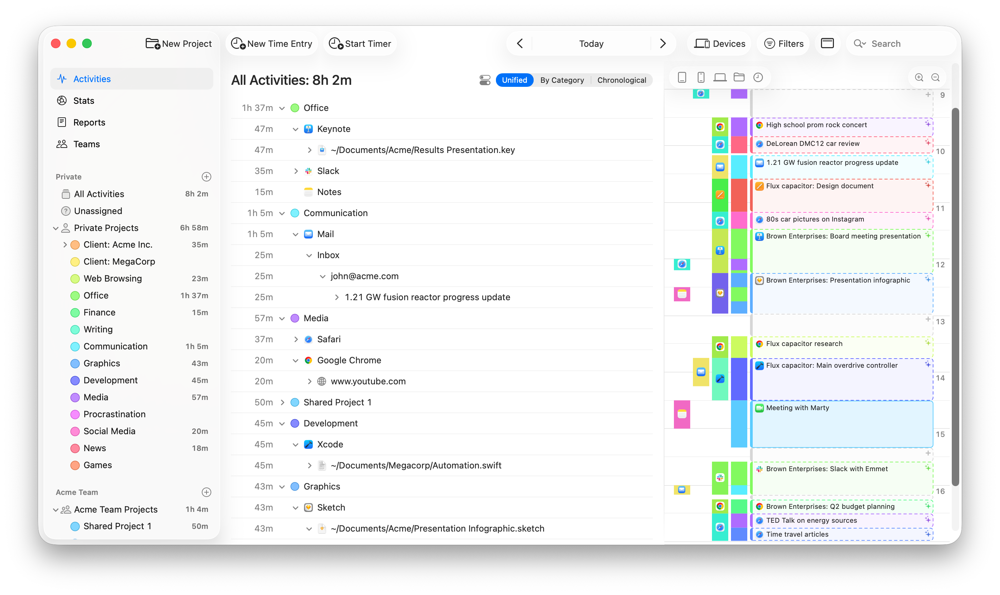

## Summary
Timing automatically tracks your time, logging apps, websites, and documents. Bill accurately and boost productivity and make manual timers a thing of the past.

## Key Details
- **Source:** [timingapp.com](https://timingapp.com/?lang=en)
- **Title:** Timing Automatic Mac Time Tracker – Manual Timers Optional
- **Description:** Timing automatically tracks your time, logging apps, websites, and documents. Bill accurately and boost productivity and make manual timers a thing of

## Visual Assets

