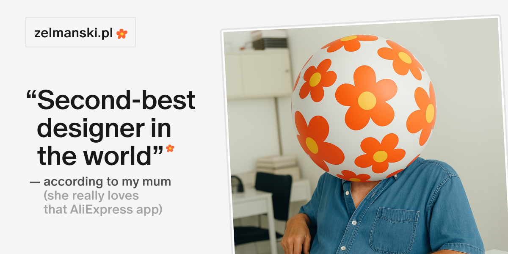

## Summary
Hi, I’m Tom Zelmański, an IC/Lead Product Designer with 20 years of experience.I build 0->1 products and create (design) systems to solve complex problems, working remotely from Gdańsk, Poland.

## Key Details
- **Source:** [zelmanski.pl](https://www.zelmanski.pl/?ref=designerdailyreport.com)
- **Title:** Tom Zelmanski - IC / Lead Product Designer
- **Description:** Hi, I’m Tom Zelmański, an IC/Lead Product Designer with 20 years of experience.I build 0->1 products and create (design) systems to solve complex prob

## Visual Assets

