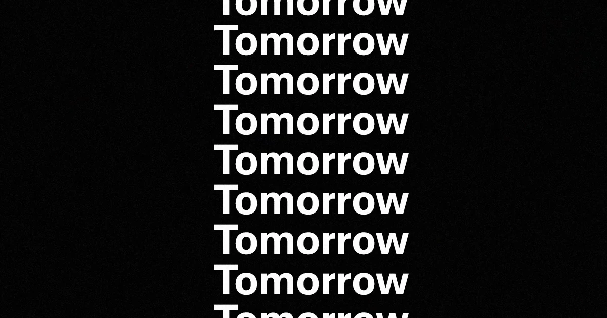

## Summary
Branding and design studio based in Vancouver, Canada on a mission to help ambitious organizations make a positive impact.

## Key Details
- **Source:** [workbytomorrow.com](https://workbytomorrow.com/)
- **Title:** Tomorrow Creative Services
- **Description:** Branding and design studio based in Vancouver, Canada on a mission to help ambitious organizations make a positive impact.

## Visual Assets

