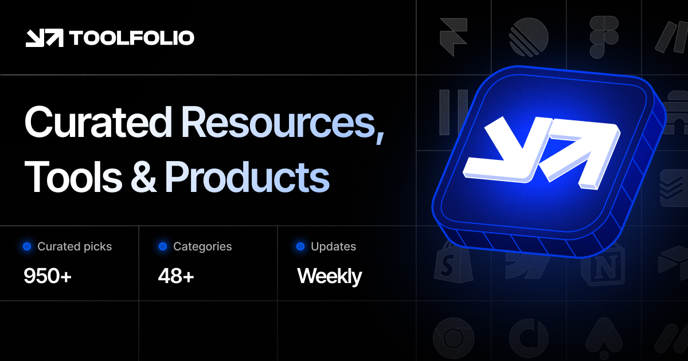

## Summary
Toolfolio helps you find the best tools for productivity, creativity, and design. Explore top solutions for startups, social media, AI, and more to optimize your workflow.

## Key Details
- **Source:** [toolfolio.io](https://toolfolio.io/)
- **Title:** Toolfolio - All the Tools You Need in One Place
- **Description:** Toolfolio helps you find the best tools for productivity, creativity, and design. Explore top solutions for startups, social media, AI, and more to op

## Visual Assets

