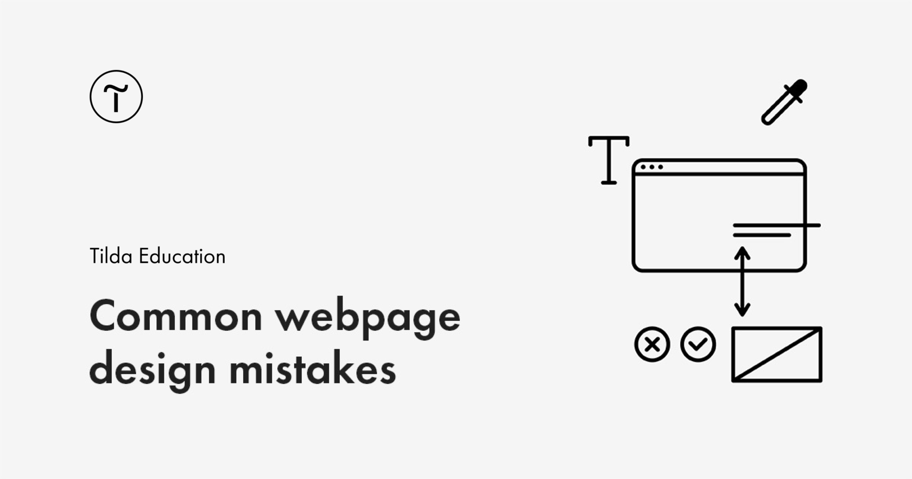

## Summary
Simple layout and design tips to help you create a stunning web page

## Key Details
- **Source:** [tilda.education](https://tilda.education/en/design-mistakes)
- **Title:** Top Web Design Mistakes To Avoid
- **Description:** Simple layout and design tips to help you create a stunning web page

## Visual Assets

