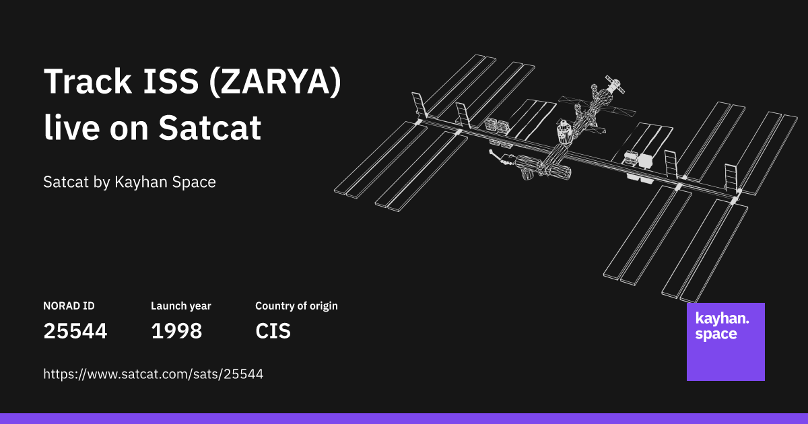

## Summary
The International Space Station (ISS) is a collaborative project involving NASA, Roscosmos, ESA, JAXA, and CSA. It is the largest human-made structure in low Earth orbit (LEO). It serves as a microgra

## Key Details
- **Source:** [satcat.com](https://www.satcat.com/sats/25544)
- **Title:** Track ISS (ZARYA) (NORAD ID: 25544) live with Satcat
- **Description:** The International Space Station (ISS) is a collaborative project involving NASA, Roscosmos, ESA, JAXA, and CSA. It is the largest human-made structure

## Visual Assets

## What Makes It Work
This is a useful knowledge and data tool that helps me understand more about the world.
