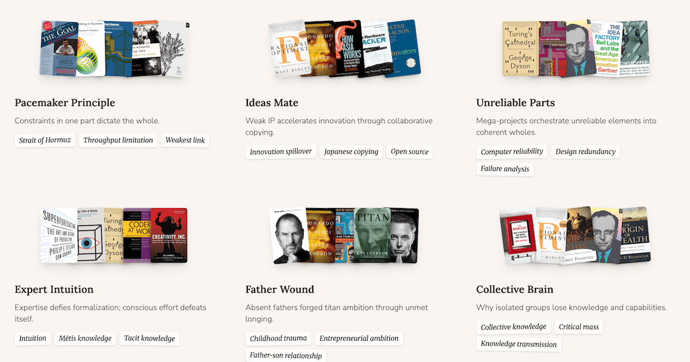

## Summary
Thematic links across books, automatically discovered by Claude.

## Key Details
- **Source:** [trails.pieterma.es](https://trails.pieterma.es/)
- **Title:** Trails
- **Description:** Thematic links across books, automatically discovered by Claude.

## Visual Assets

