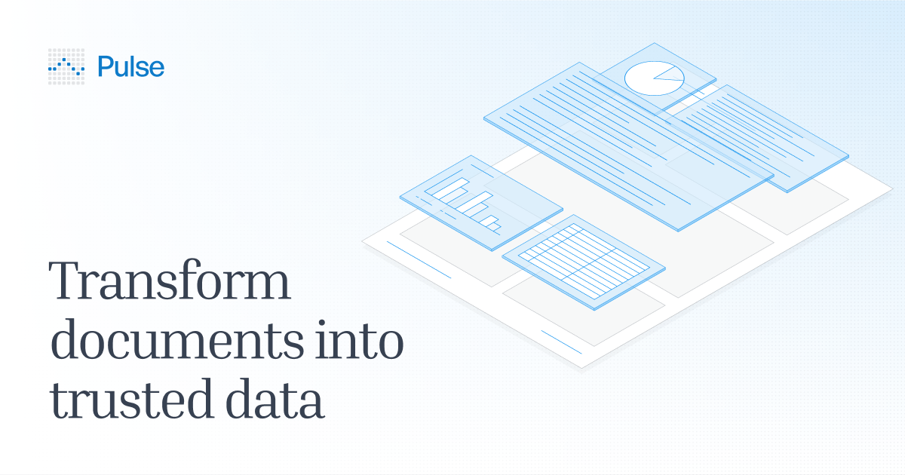

## Summary
Transform complex PDFs and scans into verified structured data. Enterprise-grade document processing with SOC 2, HIPAA, and GDPR compliance.

## Key Details
- **Source:** [runpulse.com](https://www.runpulse.com/)
- **Title:** Transform complex PDFs and scans into verified structured data. Enterprise-grade document processing with SOC 2, HIPAA, and GDPR compliance.
- **Description:** Transform complex PDFs and scans into verified structured data. Enterprise-grade document processing with SOC 2, HIPAA, and GDPR compliance.

## Visual Assets

