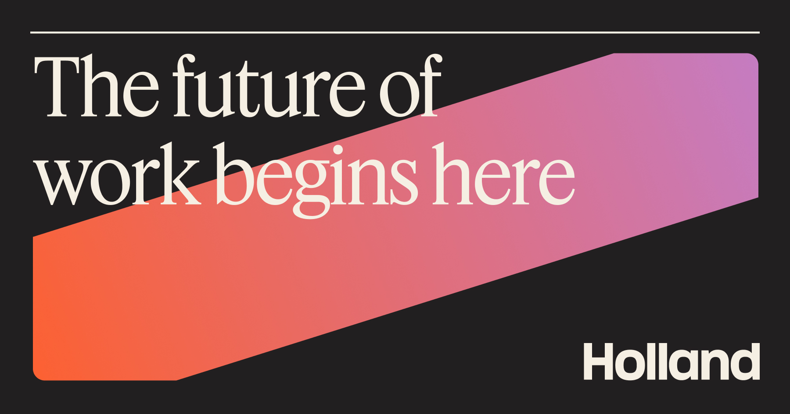

## Summary
Transform your corporate and healthcare workspace with expert interior design solutions and workplace strategy. With offices in Calgary and Edmonton, our highly-skilled team specializes in creating mo

## Key Details
- **Source:** [hollanddesign.ca](https://www.hollanddesign.ca/)
- **Title:** Transform your corporate and healthcare workspace with expert interior design solutions and workplace strategy. With offices in Calgary and Edmonton, our highly-skilled team specializes in creating modern, functional, and beautiful workplace and office designs tailored to your unique business needs. Increase productivity, employee well-being, inspire creativity and enhance collaboration. Explore our portfolio for exceptional corporate, healthcare and daycare interior designs that redefine the way you work. Holland Licensed Interior Design is a licensed firm with the Alberta Architects Association, providing the highest standard of interior design services under the Architects Act of Alberta.
- **Description:** Transform your corporate and healthcare workspace with expert interior design solutions and workplace strategy. With offices in Calgary and Edmonton, 

## Visual Assets

