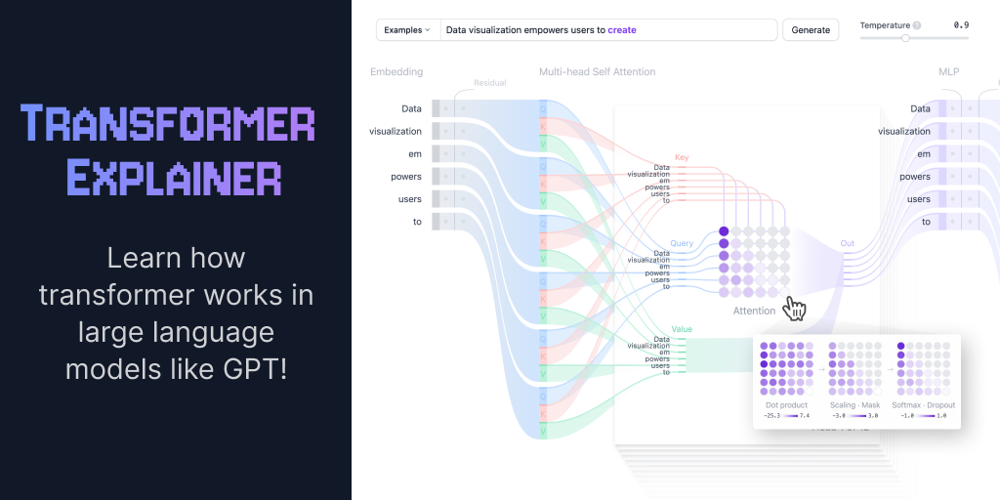

## Summary
An interactive visualization tool showing you how transformer models work in large language models (LLM) like GPT.

## Key Details
- **Source:** [poloclub.github.io](https://poloclub.github.io/transformer-explainer/)
- **Title:** Transformer Explainer: LLM Transformer Model Visually Explained
- **Description:** An interactive visualization tool showing you how transformer models work in large language models (LLM) like GPT.

## Visual Assets

