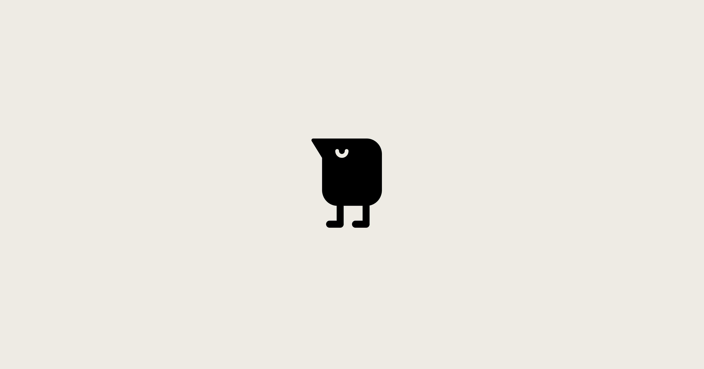

## Summary
Tweek is a FREE personal and shared to do list app to organize your tasks and collaborate on them online with your team or family. It provides a weekly calendar view mode and a reminder app. Tweek is 

## Key Details
- **Source:** [tweek.so](https://tweek.so/)
- **Title:** Tweek Calendar — Minimal To Do list and Weekly Task Planner App
- **Description:** Tweek is a FREE personal and shared to do list app to organize your tasks and collaborate on them online with your team or family. It provides a weekl

## Visual Assets

