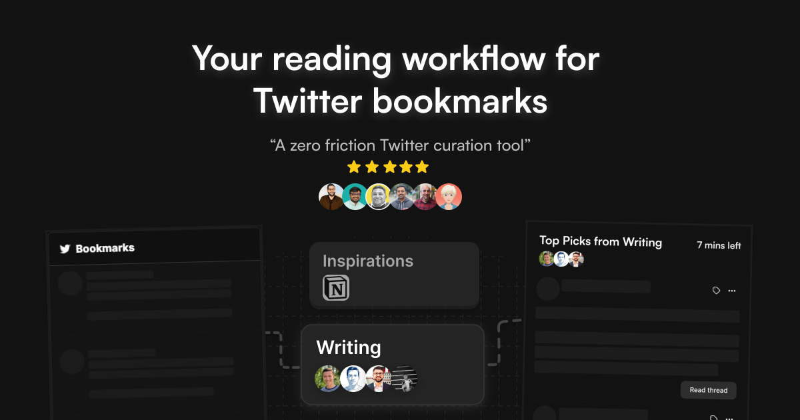

## Summary
Tweetsmash creates a reading digest from your Twitter bookmarks and streamlines the process of curating, reading, organizing, and exporting them.

## Key Details
- **Source:** [tweetsmash.com](https://www.tweetsmash.com/)
- **Title:** Tweetsmash - Get the most out of Twitter bookmarks
- **Description:** Tweetsmash creates a reading digest from your Twitter bookmarks and streamlines the process of curating, reading, organizing, and exporting them.

## Visual Assets

