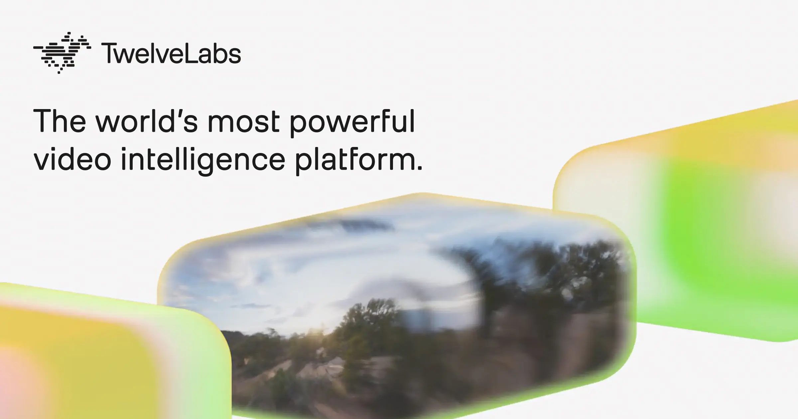

## Summary
TwelveLabs delivers enterprise video AI powered by multimodal intelligence. Search, analyze, and understand video across vision, audio, and language.

## Key Details
- **Source:** [twelvelabs.io](https://www.twelvelabs.io/)
- **Title:** TwelveLabs: Video Intelligence Platform & API
- **Description:** TwelveLabs delivers enterprise video AI powered by multimodal intelligence. Search, analyze, and understand video across vision, audio, and language.

## Visual Assets

