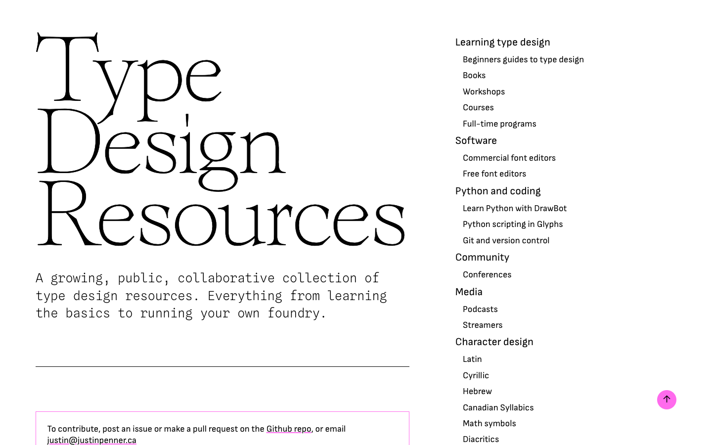

## Summary
Everything from learning the basics to running your own foundry.

## Key Details
- **Source:** [typedesignresources.com](https://typedesignresources.com/)
- **Title:** Type Design Resources
- **Description:** Everything from learning the basics to running your own foundry.

## Visual Assets

