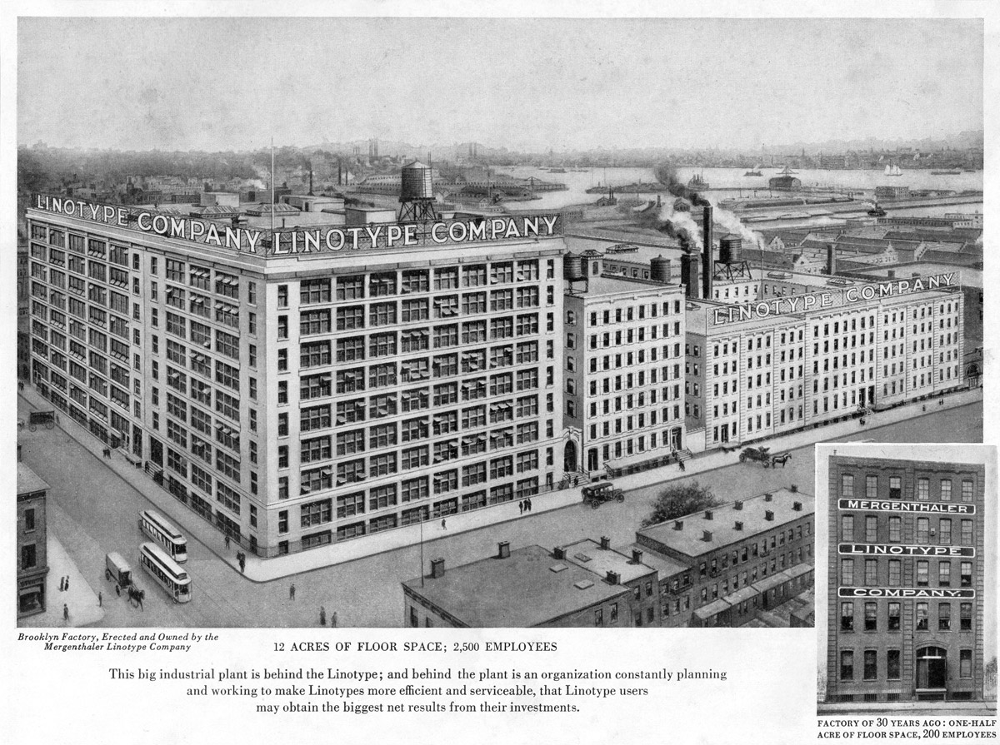

## Summary
An in-depth report on the typeface design industry and a census of the people and companies who make fonts.

## Key Details
- **Source:** [census.typographica.org](https://census.typographica.org/)
- **Title:** Type Foundries Today
- **Description:** An in-depth report on the typeface design industry and a census of the people and companies who make fonts.

## Visual Assets

