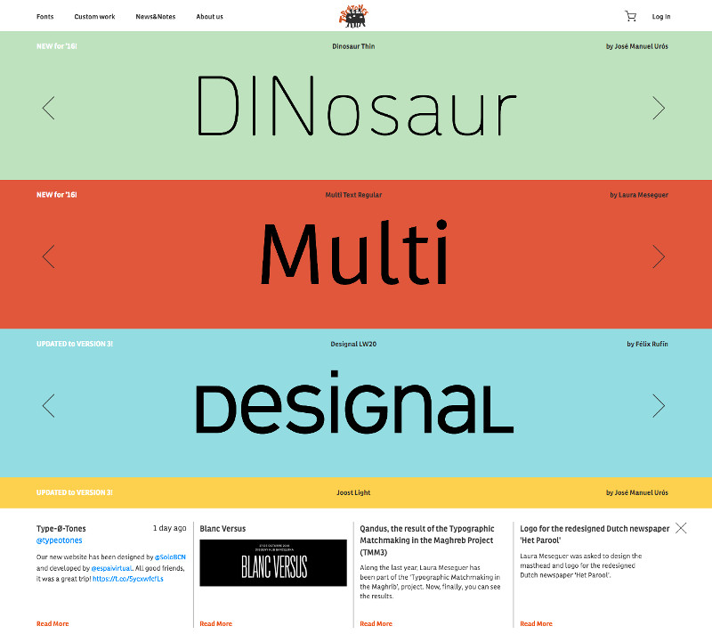

## Summary
Type-Ø-Tones is a typographic design company founded in 1990 by Joan Barjau, Enric Jardí, Laura Meseguer and José Manuel Urós. Although we mainly publish our own designs, we collaborate with many othe

## Key Details
- **Source:** [type-o-tones.com](https://type-o-tones.com/)
- **Title:** Type-Ø-Tones
- **Description:** Type-Ø-Tones is a typographic design company founded in 1990 by Joan Barjau, Enric Jardí, Laura Meseguer and José Manuel Urós. Although we mainly publ

## Visual Assets

