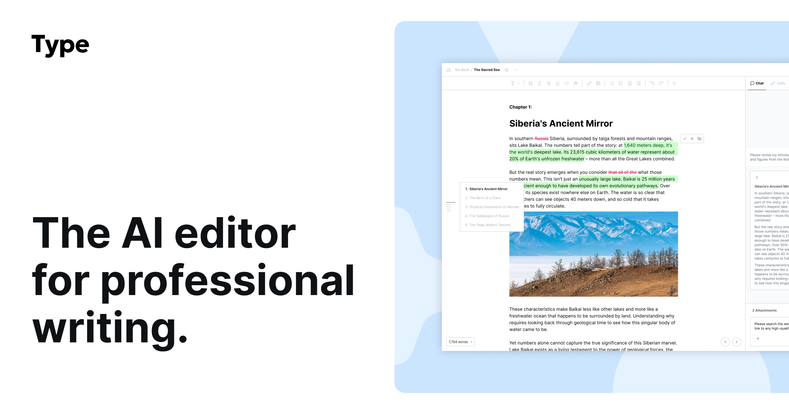

## Summary
Type.ai is the AI editor for professional writing. Join 200k+ writers who use Type to write books, novels, essays, screenplays, and long-form documents.

## Key Details
- **Source:** [type.ai](https://type.ai/)
- **Title:** Type.ai is the AI editor for professional writing. Join 200k+ writers who use Type to write books, novels, essays, screenplays, and long-form documents.
- **Description:** Type.ai is the AI editor for professional writing. Join 200k+ writers who use Type to write books, novels, essays, screenplays, and long-form document

## Visual Assets

