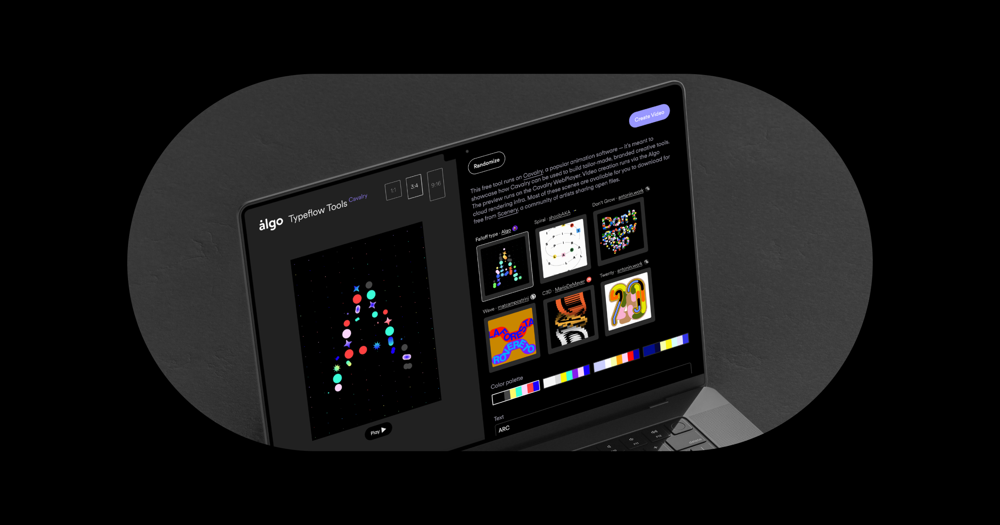

## Summary
Typeflow is a free online tool, created by Algo, to demonstrate how Cavalry can be used to build branded creative tools. Cavalry is now available as engine for Algo

## Key Details
- **Source:** [typeflow.tools](https://typeflow.tools/)
- **Title:** Typeflow.tools — Type Animation Tools in Cavalry
- **Description:** Typeflow is a free online tool, created by Algo, to demonstrate how Cavalry can be used to build branded creative tools. Cavalry is now available as e

## Visual Assets

