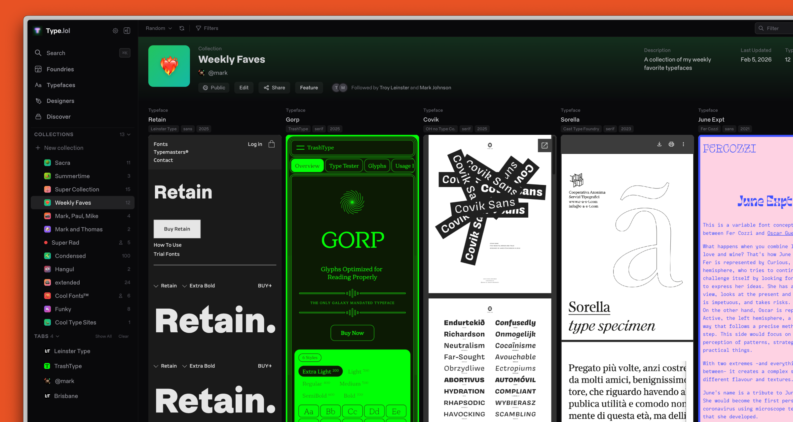

## Summary
Discover and explore independent type foundries from around the world. Browse 1,100+ foundries, 14,000+ typefaces, and 1,600+ designers.

## Key Details
- **Source:** [type.lol](https://type.lol/)
- **Title:** Type.lol - Independent Type Foundry Index
- **Description:** Discover and explore independent type foundries from around the world. Browse 1,100+ foundries, 14,000+ typefaces, and 1,600+ designers.

## Visual Assets

