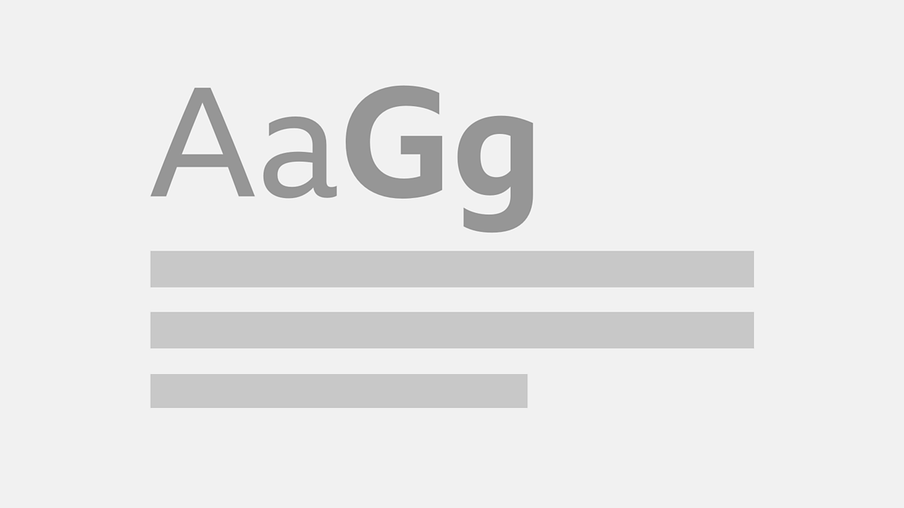

## Summary
This guideline explains how to use typography across BBC online. It covers guidance on BBC Reith, and for teams still using Helvetica.

## Key Details
- **Source:** [bbc.co.uk](https://www.bbc.co.uk/gel/features/typography)
- **Title:** Typography
- **Description:** This guideline explains how to use typography across BBC online. It covers guidance on BBC Reith, and for teams still using Helvetica.

## Visual Assets

