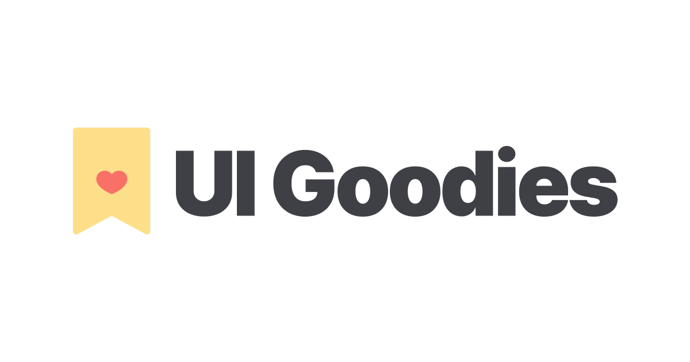

## Summary
UI Goodies is a curated directory of design resources and tools to help designers and developers create better user interfaces. Discover the best UI kits, icons, templates, and more.

## Key Details
- **Source:** [uigoodies.com](https://uigoodies.com/)
- **Title:** UI Goodies - A Directory of Design Resources & Tools
- **Description:** UI Goodies is a curated directory of design resources and tools to help designers and developers create better user interfaces. Discover the best UI k

## Visual Assets

