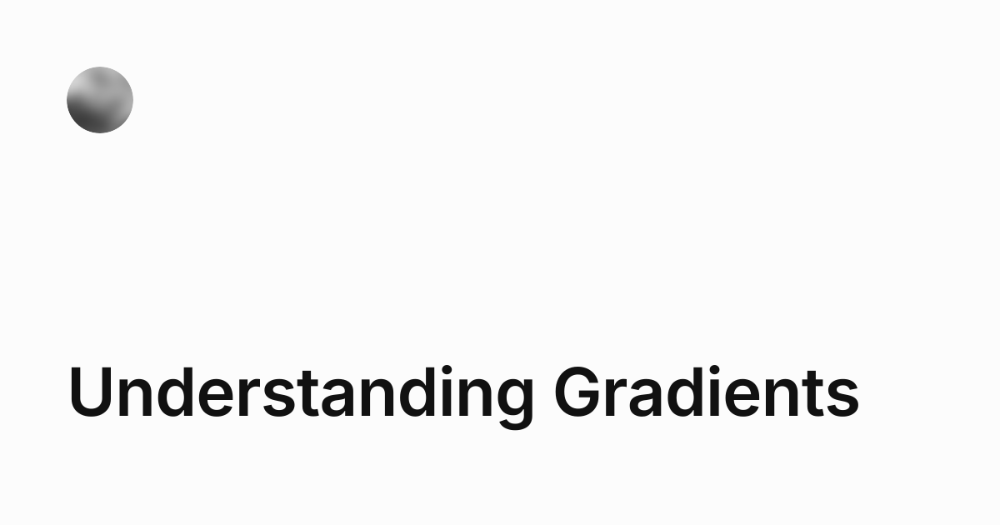

## Summary
A deep dive into how gradients work, how color models affect them and why some gradients look better than others.

## Key Details
- **Source:** [jakub.kr](https://jakub.kr/work/gradients)
- **Title:** Understanding Gradients
- **Description:** A deep dive into how gradients work, how color models affect them and why some gradients look better than others.

## Visual Assets

## What Makes It Work
I like the science behind how the gradients work and can use this knowledge in my projects.
